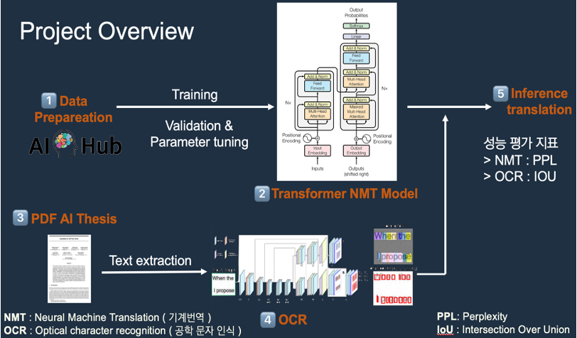

# 2023 Transformer-Based AI PDF Paper English Machine Translation Model
Implementing an AI paper translation model for English PDF

## Solution Overview


## Team member  
|||  
|-|-|
|[Jiyul Ham](https://github.com/YUL-git)|[Hyundo Lee](https://github.com/onsemiro11)|  

## File Structure
```
┖ figures
  ┖ ~
┖ Capstone_NMT.ipynb
┖ Data
 ┖ ~
┖ 함지율 졸업 작품.pdf
┖ 함지율 졸업 작품 포스터.pdf  
```
  
AE_ABOD.ipynb  
- Train and Test the Unsupervised classification model

## Dataset Overview
  
We train and evaluate our model using the dataset from [Outlier detection of Air Compressor](https://aifactory.space/competition/data/2226)

we assume that you have downloaded it and placed based on File Structure, inside the dataset folder.

## Submission Process  
Run All code in 'AE_ABOD.ipynb' to classify abnomalies of air compressor
