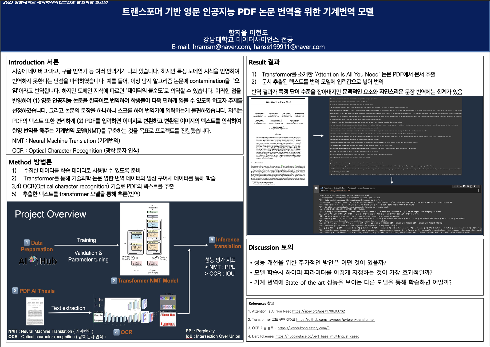

# 2023 Transformer-Based AI PDF Paper English Machine Translation Model
Implementing an AI paper translation model for English PDF

## Solution Overview
  

## Team member  
|||  
|-|-|
|[Jiyul Ham](https://github.com/YUL-git)|[Hyundo Lee](https://github.com/onsemiro11)|  

## File Structure
```
┖ figures
  ┖ ~
┖ Capstone_NMT.ipynb
┖ 함지율 졸업 작품.pdf
┖  pytorch-transformer-main
  ┖ ~   
```
## Project Poster Overview
  

## Dataset
We train and evaluate our model using the dataset from [English to Korean translation Dataset 1](https://www.aihub.or.kr/aihubdata/data/view.do?currMenu=115&topMenu=100&aihubDataSe=realm&dataSetSn=71266)  

We train and evaluate our model using the dataset from [English to Korean translation Dataset 2](https://www.aihub.or.kr/aihubdata/data/view.do?currMenu=115&topMenu=100&aihubDataSe=realm&dataSetSn=71265)

## Submission Process  
Run All code in 'AE_ABOD.ipynb' to classify abnomalies of air compressor
